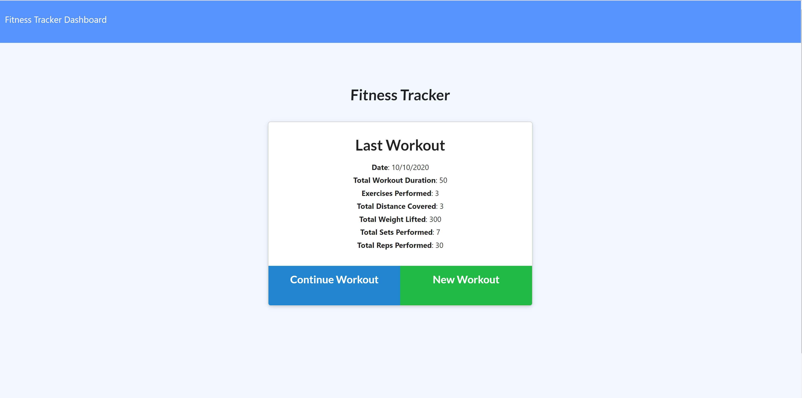
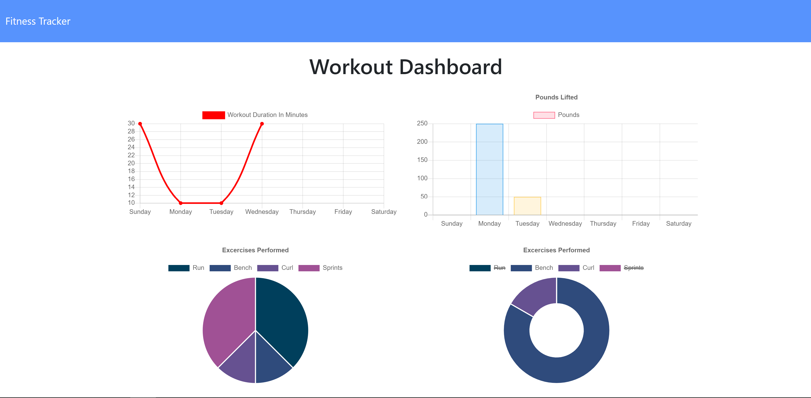

# Fitness_Tracker_JEA

## Description  

[App Link](https://ancient-peak-58816.herokuapp.com/)

Fitness Tracker is a Node.js based application using a combination of Express and MongoDB in order to View, Create, and Track daily workouts.  User is able to lob multiple exercises in a workout on a given day.  User is able to track the name, type, weight, sets, reps, and duration of exercise.  If the exercise is a cardio type, then the user is able to track distance traveled. 

* 

* 

 
 
 

## Table of Contents  
  
* [Usage](#usage-instructions)  
* [License](#license)  
* [Questions](#questions)

 
 
 

## Usage Instructions

* Application is hosted live on heroku.  Use this [Link](https://ancient-peak-58816.herokuapp.com/) to try it out!

 
 
 

## License

* Application licensed under MIT.  For more information see [license document](./LICENSE).
  
 
 
 

## Questions

Check out my GitHub page here:  [jeashwor's Page](https://github.com/jeashwor)

If you have additional questions please email me at jeashwor@gmail.com